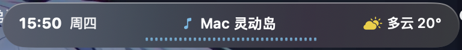
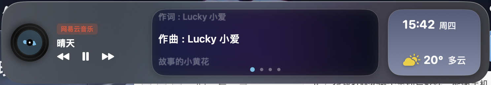
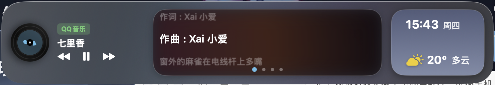
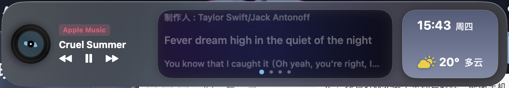
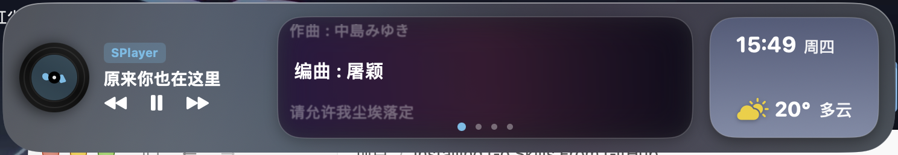

# Mac 灵动岛 使用手册

欢迎使用 **Mac 灵动岛 (Dynamic Island for macOS)**。Mac 灵动岛是一款专为 Mac 打造的沉浸式交互中枢，融合 Apple 原生工业美学，将通知提醒、系统状态、多媒体控制与流体歌词无缝衔接于屏幕顶端或边缘。

---

## 目录
- [1. 灵动岛基础与外观概览](#1-灵动岛基础与外观概览)
- [2. 多媒体与音乐播放器接入](#2-多媒体与音乐播放器接入)
  - [网易云音乐 (中国红)](#网易云音乐-neteasemusic)
  - [QQ 音乐 (翡翠绿)](#qq-音乐-qqmusic)
  - [Apple Music (桃粉紫红)](#apple-music)
  - [SPlayer 原生直连 (经典青色)](#splayer-原生直连)
- [3. 交互形态与多功能展开面板](#3-交互形态与多功能展开面板)
- [4. 交互手势与快捷键指南](#4-交互手势与快捷键指南)
- [5. 菜单栏中枢与效果预览工坊](#5-菜单栏中枢与效果预览工坊)
- [6. 常见问题与疑难解答](#6-常见问题与疑难解答)

---

## 1. 灵动岛基础与外观概览

Mac 灵动岛常驻于屏幕顶端居中位置，精准契合 MacBook 屏幕的刘海 (Notch) 或传统屏幕的顶部菜单栏下方。它采用 **超精密超采样玻璃拟态材质 (Ultra-Glassmorphic)**，具有高透光率、柔和背阴与硬件级抗锯齿圆角。

### 待机闲置状态 (Idle State)

在未播放音乐且无通知接入时，灵动岛呈现精巧温润的待机胶囊形态：



- **左侧**：实时数字时钟与星期几（随系统日历毫秒级更新）。
- **中央**：常驻轻量标识“♪ Mac 灵动岛”。
- **右侧**：当前实时天气符号、气温及天气状况（每 15 分钟自动更新）。

> [!NOTE]
> 当您开启音乐播放后，左右两侧的冗余信息将自动向两侧渐隐退场，灵动岛全宽独占交由歌词、动态波形与黑胶唱片掌控。

---

## 2. 多媒体与音乐播放器接入

Mac 灵动岛配备自主研发的 **多播放器智能桥接引擎 (MultiPlayerBridge)** 与 **系统媒体感知技术 (SystemMediaRemoteManager)**，能够以 0.1 秒的频率无感侦测当前系统活跃的音频流，自动匹配对应播放器的专属品牌色调与界面质感。

### 核心特性
- **逐字流光白光歌词 (Apple Music Word-by-Word)**：毫秒级时间戳平滑扫光与高光辉光渲染，排版稳固绝不跳跃。
- **弥散流体光晕背景 (Fluid Ambient Glow)**：根据当前正在播放歌曲的专辑封面色谱，实时生成动态流体弥散高斯模糊背景。
- **36 阶立体音频跳动波形条**：根据当前播放器的主题色彩动态染色，赋予音乐可见的生命力。
- **全自动封面与逐字歌词匹配**：即使播放器未在本地缓存歌词，云端引擎亦会在后台 0 毫秒内解析并补充原版 LRC / YRC 逐字歌词与高清唱片封面。

---

### 网易云音乐 (NeteaseMusic)

网易云音乐接入后，灵动岛全面切换为标志性的 **中国红** 品牌色调：

#### 胶囊收缩态

- **品牌音符**：左侧亮起网易红音符图标。
- **波形渲染**：底部 36 根波形条化为中国红动态律动条。
- **歌词呈现**：单行原位无缝淡入淡出，白光实时逐字扫光流动。

#### 全景展开态

- **左侧**：旋转黑胶唱片，上方附带红底白字的【网易云音乐】徽标，提供播放/暂停/上一曲/下一曲完整控制。
- **中间**：Apple Music 级别深红流体弥散背景，三行歌词平滑垂直位移滚动，唱响行智能居中并加粗高光。
- **指示器**：底部分页指示器圆点联动中国红高亮。

---

### QQ 音乐 (QQMusic)

QQ 音乐接入后，灵动岛无缝转换为清爽通透的 **翡翠绿** 主题：

#### 胶囊收缩态

- **品牌音符**：翠绿色音符图标轻巧点缀。
- **波形渲染**：纯净翡翠绿渐变波形跳动，呼吸感十足。

#### 全景展开态

- **标识徽标**：绿底白字【QQ音乐】轻量徽标，质感严谨。
- **歌词与光晕**：自动抓取周杰伦《七里香》等经典歌曲的 YRC 逐字格式，在微温墨绿弥散氛围中如水银泻地般流转。

---

### Apple Music

与 macOS 系统原生 Apple Music 达成 100% 协议直连与视觉协同，彰显高贵 **桃粉紫红**：

#### 胶囊收缩态

- **专属配色**：桃粉色高饱和音符与粉红波形跳动。

#### 全景展开态

- **原厂质感**：粉红底白字【Apple Music】标签，支持英文、多语种字符的精密基线对齐与平滑滚动。
- **零延迟响应**：通过 macOS ScriptingBridge 毫秒级调度，拖拽时间轴立即无缝重定位歌词。

---

### SPlayer 原生直连

作为深度定制的本地播放器支持，SPlayer 享有内核通道与经典 **青水蓝**：

#### 胶囊收缩态

- **连接通知**：切歌时自顶端柔和滑出青色播放状态气泡。

#### 全景展开态

- **内核直通**：直接从 SPlayer SQLite 缓存零毫秒读取逐字歌词，兼具青蓝弥散背景与唱片旋转效果。

---

## 3. 交互形态与多功能展开面板

Mac 灵动岛专注于提供极简流畅的经典横向交互体验，支持在 **极简收缩胶囊 (380×38)** 与 **全景多功能面板 (740×129)** 两种形态之间丝滑切换。


### 多功能面板四大分页
展开灵动岛后，中间区域配备了 4 大功能模块，轻点底部圆点指示器即可随时切换：
1. **Apple Music 弥散流体逐字歌词**：当前播放音乐时默认呈现，动态弥散光晕与平滑垂直歌词滚动。
2. **临时文件暂存架 (File Shelf)**：拖拽桌面常用文件即可悬浮驻留，随用随拖。
3. **沉浸式番茄钟 (Focus Timer)**：轻点开启专注倒计时，高效工作不分心。
4. **硬件状态监视器 (System Stats)**：实时呈现 CPU 负载、电源供电状态及网络实时上传/下载速率。

---

## 4. 交互手势与快捷键指南

### 鼠标与触控板手势

| 动作 | 目标区域 | 效果 |
| :--- | :--- | :--- |
| **单指轻点 (Click)** | 灵动岛任意空白区域 | 在【收缩胶囊】与【全景展开】形态之间平滑切换（音乐播放时展开优先直达歌词界面） |
| **按住并拖拽 (Drag)** | 灵动岛主体 | 实时 120Hz 任意拖移到屏幕任意位置 |
| **释放拖拽 (Release)** | 屏幕任意边缘附近 | **智能磁吸**：若靠近屏幕顶端中间 200px 范围，自动磁吸居中吸附 Notch；若靠近侧边，自动贴边停靠 |
| **点击分页圆点** | 展开面板底部 | 在【歌词】、【文件暂存库】、【番茄钟】、【系统状态】之间自由切换 |

### 键盘快捷键

- `⌥ ⌘ R` (Option + Command + R) 或 `⌘ R`：**一键居中复位**。无论灵动岛被拖移到哪个屏幕或角落，瞬间恢复置顶居中对齐屏幕顶端刘海下方。
- 菜单栏专属快捷键：
  - `P`：播放 / 暂停当前音乐
  - `N`：切换至下一首歌曲
  - `Q`：退出 Mac 灵动岛

---

## 5. 菜单栏中枢与效果预览工坊

在屏幕右上角常驻的系统菜单栏中，点击胶囊图标 `灵动岛` 即可调出快捷设置控制台：

```text
🏝️ Mac 灵动岛 (Dynamic Island)
─────────────────────────────────
🧲 居中对齐屏幕顶端 (⌥⌘R)                 (R)
─────────────────────────────────
🎵 音乐播放器接入与效果预览 >
    当前活跃: 网易云音乐
    ─────────────────────────────
    🔴 预览网易云音乐效果 (周杰伦《晴天》)     (1)
    🟢 预览QQ音乐效果 (周杰伦《七里香》)     (2)
    🟣 预览Apple Music效果 (Taylor Swift)  (3)
    🔵 预览SPlayer效果 (刘若英)            (4)
    ─────────────────────────────
    🔄 恢复系统实时自动检测                (0)
─────────────────────────────────
播放/暂停音乐                             (P)
切换下一首歌曲                           (N)
退出灵动岛                               (Q)
```

> [!TIP]
> **无需安装额外客户端即可提前体验！**
> 即使您的 Mac 电脑上尚未下载安装网易云音乐或 QQ 音乐，只需点击【预览网易云音乐效果】或【预览QQ音乐效果】，灵动岛将立即连接官方云端歌词封面库，让您即刻感受原汁原味的品牌色与逐字歌词律动！

---

## 6. 常见问题与疑难解答

### Q1: 移动了灵动岛之后找不到它，或者想快速让它回到屏幕顶端居中怎么办？
> **答**：请直接按下全局快捷键 `⌥ ⌘ R`（即 Option + Command + R），或者在顶部菜单栏点击 `灵动岛` 图标并选择【🧲 居中对齐屏幕顶端】，灵动岛将立即精准复位回刘海正下方。

### Q2: 电脑上同时打开了网易云音乐和 SPlayer，灵动岛会听谁的？
> **答**：灵动岛具有严格的多源仲裁策略。SPlayer 具有专用内核直连通道，当 SPlayer 处于实际播放状态时享有第一优先级；当 SPlayer 暂停且网易云音乐或 Apple Music 开始出声时，系统媒体感知引擎将在 0.1 秒内切换显示当前实际出声的播放器及其品牌主题色。

### Q3: 为什么有时候歌词第一句没有立刻逐字变白？
> **答**：当前唱响行会严格按照歌手发音起止时间戳进行扫光。若歌曲前奏有长达十几秒的吉他独奏或前奏旋律（如《晴天》或《七里香》），灵动岛在前奏阶段会显示当前歌曲的作词/作曲等演职人员信息或常驻曲名，一旦人声唱响，白光高光将精准逐字跟进。

---

*文档版本：v2.4 Pro Edition · 适用于 macOS Sonoma / Sequoia 及更高版本*
